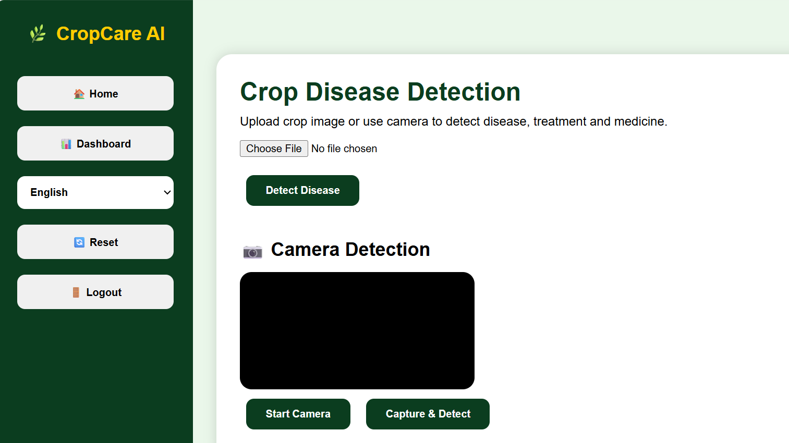
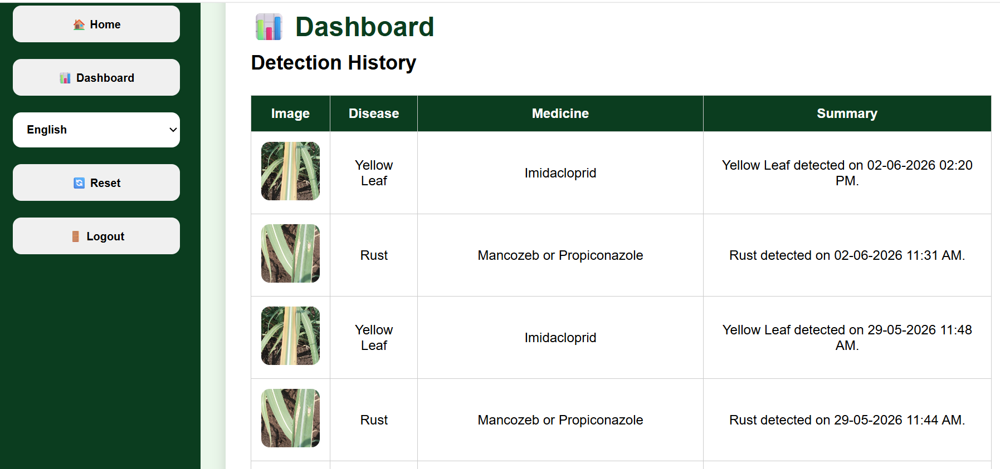

# CropCare AI - AI Based Crop Disease Detection System

## Overview

CropCare AI is a Flask-based web application that uses Deep Learning to detect sugarcane leaf diseases from uploaded or camera-captured images. The system predicts the disease, displays confidence scores, and provides treatment recommendations to farmers.

## Features

* Sugarcane Disease Detection using Deep Learning
* Image Upload Support
* Camera Capture Support
* Disease Prediction with Accuracy Score
* Treatment and Prevention Recommendations
* User Login and Registration
* Dashboard Analytics
* Prediction History Storage
* Multilingual Support (English, Hindi, Marathi)
* Responsive User Interface

## Technologies Used

### Frontend

* HTML
* CSS
* JavaScript

### Backend

* Flask (Python)

### Machine Learning

* TensorFlow
* Keras
* OpenCV
* NumPy
* Pillow

### Database

* SQLite

## Diseases Detected

* Healthy
* Mosaic
* Red Rot
* Rust
* Yellow Leaf Disease
* Brown Rust
* Brown Spot
* Grassy Shoot
* Banded Chlorosis

## Project Structure

```text
crop-disease-website/
│
├── app.py
├── train_model.py
├── model.h5
├── cropcare.db
├── requirements.txt
│
├── static/
│   ├── bg.jpg
│   └── uploads/
│
├── templates/
│   ├── index.html
│   ├── login.html
│   └── register.html
│
├── Screenshots/
│   ├── login.png
│   ├── home.png
│   └── dashboard.png
│
└── README.md
```

## Screenshots

### Login Page


### Home Page



### Dashboard



## Installation

### Clone Repository

```bash
git clone https://github.com/shreyapatil31/AI-Based-Crop-Disease-Detection-System-From-Images.git
cd AI-Based-Crop-Disease-Detection-System-From-Images
```

### Install Dependencies

```bash
pip install -r requirements.txt
```

### Run Application

```bash
python app.py
```

Open:

```text
http://127.0.0.1:5000
```

## Future Enhancements

* Vision Transformer (ViT) Based Disease Detection
* Disease Severity Estimation
* Explainable AI (Grad-CAM)
* Weather-Based Disease Alerts
* Mobile Application Support
* Early Disease Prediction

## Author

**Shreya Patil**
Artificial Intelligence and Data Science Engineering

## License

This project is developed for academic and educational purposes.
